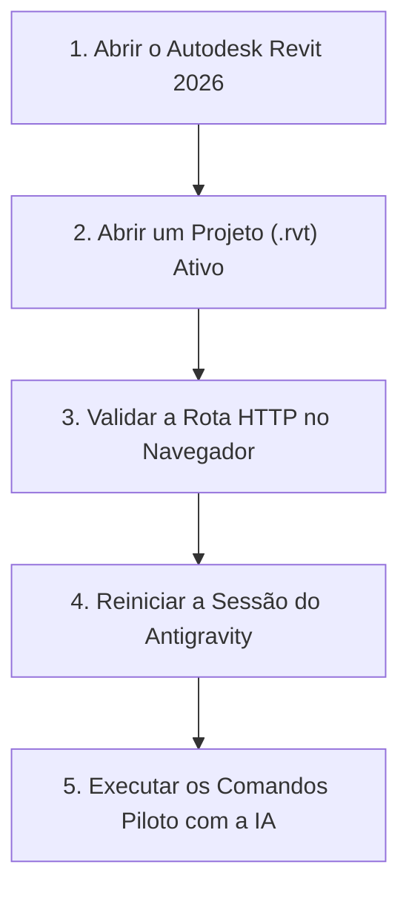

# Roteiro de Execução e Primeiros Testes: Revit MCP Server

Este documento serve como guia prático, didático e atualizado com base na documentação oficial dos
projetos `Demolinator/revit-mcp-server` e `Demolinator/revit-mcp-plugin`. Ele consolida as etapas
operacionais necessárias para validar e iniciar o uso do servidor MCP do Autodesk Revit no
Google Antigravity.

---

## 1. Contexto e Diagnóstico do Sistema

Toda a infraestrutura no sistema operacional já foi concluída e verificada:

- **Autodesk Revit 2026**: Instalado em `C:\Program Files\Autodesk\Revit 2026\` e anexado ao pyRevit.
- **Git para Windows**: Instalado e operacional no PATH (`C:\Program Files\Git\cmd\git.exe`).
- **uv Package Manager**: Instalado e operacional (`C:\Users\nicol\.local\bin\uv.exe`).
- **pyRevit v7.0**: Instalado em `C:\Users\nicol\AppData\Roaming\pyRevit-Master` com servidor Routes
  habilitado na porta `48884`.
- **Servidor MCP Demolinator**: Clonado em `C:\tools\revit-mcp-server` com ambiente virtual `.venv`
  completo (32 pacotes sincronizados) e 22 testes unitários offline validados com sucesso.
- **Extensão pyRevit**: Vínculo simbólico (_Junction_) criado em
  `C:\pyRevitExtensions\revit-mcp.extension`.
- **Configuração do Google Antigravity**: Declarada no arquivo [`.agents/mcp_config.json`](../mcp_config.json)
  apontando diretamente para o executável do ambiente virtual Python
  (`C:\tools\revit-mcp-server\.venv\Scripts\python.exe`).

---

## 2. Passo a Passo Oficial para Começar a Usar



### Etapa 1: Abrir o Autodesk Revit 2026 com um Modelo

1. Inicie o executável do **Autodesk Revit 2026**.
2. Na barra de menus superior, confirme que a aba **pyRevit** está visível.
   - _Se a aba não estiver visível_, execute no terminal:
     ```powershell
     pyrevit attach master default 2026
     ```
     e reinicie o Revit.
3. Abra um projeto de teste ou crie um modelo a partir do template arquitetônico padrão
   (exemplo: `DefaultMetric.rte` ou `rac_basic_sample_project.rvt`).

> [!IMPORTANT]
> O servidor MCP do Revit opera diretamente na memória sobre o **documento ativo**. Caso o Revit
> permaneça na tela inicial de boas-vindas sem nenhum arquivo aberto, as consultas retornarão erro
> de documento inativo.

---

### Etapa 2: Validar a Ponte Local pyRevit Routes

O servidor pyRevit Routes inicia automaticamente junto com o carregamento do Revit. Para certificar
que a comunicação interna está saudável, realize um teste em dois níveis:

#### Teste de Nível 1: Verificação da Porta do Servidor

Acesse no navegador ou terminal:
[http://localhost:48884/](http://localhost:48884/)

Qualquer resposta retornada (mesmo uma página padrão ou JSON do pyRevit) confirma que a porta `48884`
está aberta e ouvindo conexões locais.

#### Teste de Nível 2: Verificação da Extensão Demolinator

Acesse no navegador:
[http://localhost:48884/revit_mcp/status/](http://localhost:48884/revit_mcp/status/)

**Resposta de Sucesso Esperada (JSON)**:

```json
{
  "status": "active",
  "project_title": "Projeto1 - Planta de piso"
}
```

---

### Etapa 3: Recarregar a Sessão do Google Antigravity

Com o Revit aberto e a resposta `"status": "active"` confirmada:

1. Reinicie a sessão atual do Google Antigravity ou abra uma nova conversa neste repositório.
2. O Antigravity executará o servidor declarado em [`.agents/mcp_config.json`](../mcp_config.json)
   via transporte `stdio`:
   - **Comando**: `C:\tools\revit-mcp-server\.venv\Scripts\python.exe`
   - **Argumento**: `C:\tools\revit-mcp-server\main.py`
   - **Variáveis**: `REVIT_HOST: localhost` e `REVIT_PORT: 48884`
3. As 48 ferramentas do Revit serão montadas e integradas ao ecossistema do assistente.

---

## 3. Roteiro Piloto de Testes Didáticos (Hands-On)

Para se familiarizar com a atuação do assistente na modelagem BIM sem risco a projetos reais,
execute esta sequência pedagógica de quatro etapas em um modelo de teste:

### Teste 1: Diagnóstico e Reconhecimento de Modelo

Solicite ao assistente:

> "Verifique o status da conexão com o Revit e liste as informações gerais do modelo aberto."

- **Ferramentas disparadas**: `get_revit_status`, `get_revit_model_info`.
- **Objetivo didático**: Confirmar o aperto de mão (_handshake_) digital e a leitura do título do
  arquivo, número e localização.

### Teste 2: Leitura de Níveis e Famílias Carregadas

Solicite ao assistente:

> "Liste os níveis existentes no projeto com suas respectivas cotas em milímetros e informe quais
> tipos de paredes básicas estão disponíveis."

- **Ferramentas disparadas**: `list_levels`, `list_families`.
- **Objetivo didático**: Demonstrar como a IA mapeia a hierarquia de tipos e pavimentos antes de
  iniciar qualquer traçado.

### Teste 3: Modelagem Experimental de um Ambiente

Solicite ao assistente:

> "Crie um novo nível chamado 'Pavimento Técnico' a 3000 mm de altura e modele quatro paredes
> formando uma sala retangular de 5000 mm por 4000 mm no Nível 1."

- **Ferramentas disparadas**: `create_level`, `create_line_based_element`.
- **Objetivo didático**: Visualizar a geração paramétrica instantânea na tela do Revit,
  respeitando as conversões métricas automáticas (milímetros para pés internos).

### Teste 4: Captura Gráfica da Vista 3D

Solicite ao assistente:

> "Capture uma imagem da vista ativa do Revit e mostre aqui no chat."

- **Ferramentas disparadas**: `get_revit_view`.
- **Objetivo didático**: Avaliar o retorno visual da volumetria diretamente na conversa.

---

## 4. Tabela de Solução de Problemas (Troubleshooting Oficial)

| Problema Identificado                              | Causa Provável                                                 | Solução Rápida                                                                                                                   |
| :------------------------------------------------- | :------------------------------------------------------------- | :------------------------------------------------------------------------------------------------------------------------------- |
| **Aba pyRevit não aparece no topo do Revit**       | O pyRevit não está anexado à versão 2026                       | No terminal, execute `pyrevit attach master default 2026` e reinicie o Revit                                                     |
| **"Não foi possível conectar" em localhost:48884** | O servidor Routes está desligado ou o Revit não foi reiniciado | No Revit: aba **pyRevit** > **Settings** > **Routes** > marque **Enable Routes Server** e clique em **Save Settings and Reload** |
| **Página /revit_mcp/status/ retorna código 404**   | A extensão não foi carregada pelo pyRevit                      | Verifique se o caminho `C:\pyRevitExtensions` está presente em **Custom Extension Directories** nas configurações do pyRevit     |
| **Ferramentas retornam erro de documento inativo** | O Revit está aberto sem nenhum projeto carregado               | Abra um projeto `.rvt` ou crie um novo arquivo pelo template padrão                                                              |
| **Erro de tipo de família ao criar elementos**     | Nome do tipo de família não existe no template                 | Peça ao assistente para rodar `list_families` antes da criação para conferir os nomes exatos                                     |

---

## 5. Boas Práticas e Recomendações

1. **Persistência de Dados e Salvamento**:
   - Cada ação executada gera uma transação na API do Revit, permitindo desfazimento imediato
     (`Ctrl + Z`).
   - Solicite periodicamente o comando `save_document` para salvar alterações consolidadas.
2. **Ambiente Isolado**:
   - O uso do executável direto do ambiente virtual `.venv` assegura que nenhuma atualização de
     Python no sistema operacional interfira no funcionamento do servidor MCP.
3. **Expansão da Base de Conhecimento**:
   - À medida que novas rotinas de modelagem forem validadas, estruture tutoriais e referências
     didáticas em arquivos MDX dentro da pasta `docs/revit/`.
