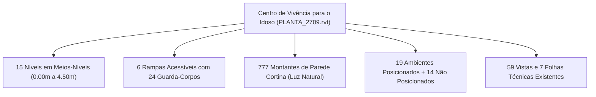

# Plano Diretor de Documentação: Centro de Vivência para o Idoso

Este plano consolida as diretrizes técnicas e operacionais extraídas da documentação oficial do
Autodesk Revit 2026 sobre documentação e apresentação de projetos, traduzidas e aplicadas diretamente
à realidade do projeto **Centro de Vivência para o Idoso** (`PLANTA_2709.rvt`).

---

## 1. Diagnóstico do Modelo Atual

A inspeção realizada no modelo ativo revela uma estrutura arquitetônica horizontal rica, com forte
ênfase na fluidez espacial e na acessibilidade universal:

### Síntese dos Dados Técnicos

- **Conformação Espacial**: Edifício organizado em platôs com desníveis de `0.50 m` e `1.00 m`,
  conectados por rampas acessíveis e protegidos por fechamentos translúcidos envidraçados.
- **Programa de Atividades**: Áreas dedicadas à saúde (Fisioterapia, Enfermagem, Odontologia),
  expressão artística (Cerâmica, Música, Salas de Artes 1 e 2), convivência e cognição (Midiateca,
  Informática, Práticas Corporais) e núcleos sanitários.
- **Oportunidades Imediatas de Documentação**:
  - Regularizar a exibição das plantas baixas que atravessam múltiplos meios-níveis.
  - Posicionar os 14 cômodos pendentes para fechar o quadro oficial de áreas e ocupação.
  - Criar um diagrama de setorização colorido com legendas automáticas para bancas ou aprovação.
  - Estruturar o caderno de 7 pranchas formato A1 com carimbos e pranchas executivas completas.

---

## 2. Roteiro de Execução em Cinco Fases

---

### Fase 1: Fechamento do Programa de Necessidades e Ambientes

Para que as tabelas de áreas e as legendas de prancha funcionem automaticamente, o banco de dados de
ambientes precisa estar íntegro.

1. **Posicionar os 14 Ambientes Pendentes**:
   - No Navegador de Projeto, abra a tabela de ambientes existente ou a vista de planta baixa.
   - Ative a ferramenta **Ambiente** (atalho: `RM`).
   - No menu suspenso superior de seleção de ambientes na barra de opções, selecione os nomes
     cadastrados que ainda não possuem localização física e clique dentro dos compartimentos
     delimitados.
   - Utilize a ferramenta **Separador de Ambiente** para delimitar circulações abertas, halls e
     varandas sem paredes físicas.
2. **Padronizar o Parâmetro de Departamento (_Setorização_)**:
   - Selecione cada ambiente e preencha o campo **Departamento** nas Propriedades com os seguintes
     grupos funcionais:
     - `Saúde e Terapia`: Fisioterapia, Enfermagem, Dentistas.
     - `Cultura e Aprendizado`: Cerâmica, Artes 1, Artes 2, Música, Midiateca, Informática.
     - `Convivência e Corpo`: Práticas Corporais, Pátios e Estar.
     - `Apoio e Sanitários`: WCs Acessíveis, Vestiários, DML e Depósitos.
3. **Gerar a Tabela Resumo de Áreas**:
   - Verificar a tabela existente no Navegador de Projeto (`Tabelas/Quantidades`) e conferir o
     cálculo de área total útil e percentuais de ocupação por setor.

---

### Fase 2: Padronização Gráfica das Vistas e Desníveis

Como o edifício possui meios-níveis escalonados, a visualização em planta exige cuidados técnicos.

1. **Aplicação de Regiões de Planta (_Plan Regions_) nos Meios-Níveis**:
   - Em plantas que abrangem setores com cotas desiguais (por exemplo, Bloco A a `0.00 m` e Bloco B a
     `+1.00 m`), acesse a aba **Vista** > **Vistas de Planta** > **Região da Planta**.
   - Desenhe o perímetro sobre o bloco mais elevado e defina um plano de corte local a `+2.20 m`
     (para cortar as paredes a `1.20 m` do piso daquele setor específico).
   - Isso garante que portas e janelas de ambos os blocos apareçam abertas e cortadas na mesma
     folha de desenho.
2. **Configuração do Esquema de Cores Setorial (_Color Scheme_)**:
   - Nas propriedades da planta de estudo ou apresentação, clique no campo **Esquema de Cores**.
   - Defina o critério por **Departamento**.
   - Atribua tonalidades suaves e didáticas a cada setor funcional.
   - Insira a **Legenda de Preenchimento de Cor** através da aba **Anotação** para expor a
     amostra de cor e o nome de cada setor.
3. **Criação de Modelos de Vista (_View Templates_)**:
   - Crie o modelo `ARQ - Planta Baixa Setorial 1:100` para apresentações humanizadas (com cores e
     sombras suaves).
   - Crie o modelo `ARQ - Planta Baixa Técnica 1:50` para plantas cotadas e detalhadas (sem cores
     de preenchimento, com linhas de corte em espessura normativa).

---

### Fase 3: Detalhamento Técnico e Anotações ABNT / NBR 9050

A documentação para centros de idosos deve evidenciar com clareza a acessibilidade plena.

1. **Anotação de Rampas e Circulações**:
   - Utilize a ferramenta **Inclinação de Ponto** (_Spot Slope_) para indicar a inclinação
     percentual exata das 6 rampas (por exemplo, `i = 6.25%` ou `i = 8.33%`, em conformidade com a
     NBR 9050).
   - Insira **Cotas de Elevação** (`EL`) no início e no final de cada rampa para demonstrar as
     cotas de nível acabado dos patamares.
2. **Cotas Gerais e Eixos Estruturais**:
   - Utilize a ferramenta **Cota Alinhada** (`DI`) para criar linhas contínuas de cotas:
     - Linha 1: Cotas parciais de vãos e bonecas de portas/janelas.
     - Linha 2: Cotas entre eixos estruturais.
     - Linha 3: Cota total externa da edificação.
3. **Identificação de Esquadrias e Ambientes**:
   - Acione a ferramenta **Identificar Todos** na aba **Anotação** para rotular todas as portas e
     janelas com identificadores padronizados (ex: `P01`, `J02`).
   - Confirme se todos os cômodos possuem o identificador de ambiente (`RT`) visível com nome e
     área (`m²`).
4. **Cortes Estratégicos**:
   - Ajuste os 5 cortes existentes para que pelo menos dois deles sejam longitudinais, atravessando
     as rampas principais e demonstrando a transição suave entre os níveis.

---

### Fase 4: Montagem do Caderno de Pranchas (7 Folhas A1)

Estruturação recomendada para o caderno técnico de apresentação do Centro de Vivência:

| Prancha  | Título da Folha                                   | Conteúdo Gráfico e Escalas Recomendadas                                               |
| :------- | :------------------------------------------------ | :------------------------------------------------------------------------------------ |
| `ARQ-01` | **Implantação, Cobertura e Memorial Geral**       | Planta de cobertura (1:200), norte magnético, carimbo e tabela geral de áreas.        |
| `ARQ-02` | **Setorização e Diagrama de Usos**                | Planta baixa geral colorida por setores com legenda de departamentos (1:100).         |
| `ARQ-03` | **Planta Baixa Técnica - Bloco A e Meios-Níveis** | Planta cotada executiva com eixos estruturais, tags de portas e janelas (1:50).       |
| `ARQ-04` | **Planta Baixa Técnica - Bloco B e Serviços**     | Planta cotada executiva dos setores de saúde, terapias e sanitários (1:50).           |
| `ARQ-05` | **Cortes Longitudinais e Transversais**           | 4 a 5 cortes com cotas de nível, demonstrando o escalonamento das rampas (1:50).      |
| `ARQ-06` | **Elevações e Fachadas**                          | 4 fachadas ortogonais com estudo de sombras ativado e materiais (1:100).              |
| `ARQ-07` | **Acessibilidade e Vistas Tridimensionais**       | Isometria explodida, detalhes de sanitários acessíveis (1:25) e perspectivas cônicas. |

---

### Fase 5: Exportação em PDF Vetorial e Entrega

1. Acesse **Arquivo** > **Exportar** > **PDF**.
2. Selecione a lista de folhas técnicas (`ARQ-01` até `ARQ-07`).
3. Ajuste o tamanho da folha para `ISO A1` com **Zoom 100%** e **Processamento Vetorial**.
4. Exporte o arquivo PDF consolidado com linhas nítidas para apresentação digital ou plotagem.

---

## 3. Guias de Apoio Disponíveis na Base de Conhecimento

Para consultar os tutoriais detalhados e procedimentos passo a passo criados com base na
documentação oficial do Revit 2026, acesse:

- [Tutorial de Montagem de Folhas](../../docs/revit/tutorials/guia-basico-documentacao-pranchas.mdx)
- [Guia de Configuração de Vistas e Desníveis](../../docs/revit/guides/configuracao-vistas-e-modelos-de-vista.mdx)
- [Catálogo de Ferramentas e Atalhos](../../docs/revit/reference/catalogo-ferramentas-documentacao.mdx)
- [Fundamentos Teóricos do Fluxo BIM](../../docs/revit/explanation/fluxo-documentacao-bim-arquitetura.mdx)
