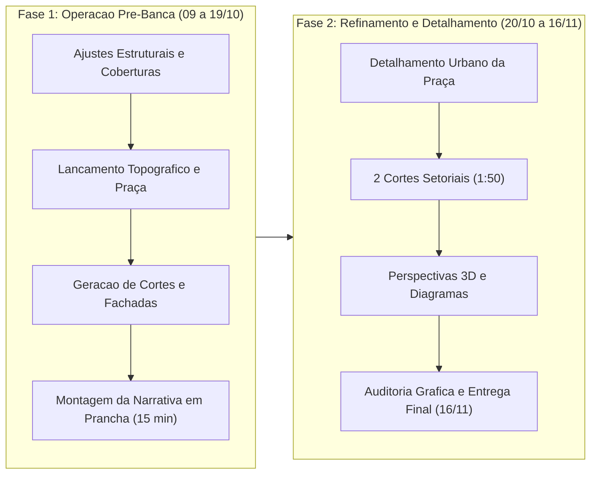

# Plano de Acao Estrategico — Reta Final TCC de Arquitetura

**Data de Inicio:** 09 de outubro de 2026  
**Marco Intermediario (Pre-Banca):** 19 de outubro de 2026 (10 dias)  
**Marco Final (Entrega Patrícia):** 16 de novembro de 2026 (38 dias)  
**Autora:** Nicole  
**Orientador:** Prof. Pedro  

---

## 1. Diretriz Metodologica e Estrategia de Voo

Para alcancar a maxima nota na banca final sem sobrecarga desnecessaria, a execucao sera dividida em duas fases estrategicas:

> [!IMPORTANT]
> **A Regra de Ouro da Producao:** Nao altere mais as disposicoes internas de layout ou dimensoes de salas. O layout atual esta validado para a escala 1:200. Toda a sua energia produtiva deve ser direcionada a criar o que ainda nao existe: volumetria exterior, coberturas, cortes, fachadas e a praça.

---

## 2. Fase 1: Operacao Pre-Banca (10 Dias Corridos: 09 a 19 de Outubro)

O objetivo desta fase e estruturar a totalidade da narrativa de 15 minutos e exibir todas as pecas graficas exigidas pelo professor Pedro, utilizando reservas graficas formais (retangulos de chamada) para os desenhos que estiverem em fase final de detalhamento.

### Bloco A: Fechamento Volumetrico e Estrutural no Revit (09 a 11/10)

- **Sexta-feira (09/10 - Noite):**
  - **Ajuste de Pilares:** Reposicionar os pilares do vão da escada e do corredor para o alinhamento da parede do comodo vizinho, liberando o vazio de circulacao vertical.
  - **Vigas de Borda:** Lancar no perimetro do vazio da piscina a viga de borda em concreto, amarrando as vigas transversais que chegam dos pilares.
- **Sabado (10/10 - Dia):**
  - **Cobertura da Piscina:** Modelar telhado em agua unica com telha metalica termoacustica tipo sanduiche (inclinacao de 8% a 10%).
  - **Transicoes Metalicas:** Modelar a familia ou extrusao basica das pecas metalicas diagonais ("tipo galhos/arvore") saindo do topo dos pilares de concreto para apoiar as tercas da cobertura.
  - **Marquise de Entrada:** Inserir a cobertura rebaixada na porta principal de acesso voltada para a praça.
  - **Cobertura dos Demais Blocos:** Modelar platibanda recuada (1,50 m para dentro da fachada) com telhado metalico oculto de baixa inclinacao.
- **Domingo (11/10 - Dia):**
  - **Topografia e Muro de Arrimo:** Lancar o corte topografico no terreno e modelar o muro de arrimo com afastamento de 2,50 m da parede do edificio.
  - **Volumetria da Praça Central:** Definir os patamares da praça de 10 m de largura. Modelar os modulos circulares de cobertura ("guarda-sois metalicos") nos eixos de circulacao, variando diametros (1,80 m, 3,00 m e 3,20 m) e alturas alternadas.

### Bloco B: Extracao e Configuracao das Vistas Tecnicas (12 a 15/10)

- **Segunda-feira (12/10): 4 Cortes Gerais (1:200)**
  - Passar as 4 linhas de corte estrategicas pelo modelo (2 longitudinais e 2 transversais, cortando piscina, atelie, escada e praça central).
  - Desenhar a linha do Perfil Natural do Terreno (traco tracejado vermelho visivel).
  - Inserir cotas de nivel acabadas (internas e externas) e cotas de eixos estruturais.
  - Inserir componentes de escala humana (figuras humanas em corte).
- **Terca-feira (13/10): 4 Elevacoes/Fachadas (1:200)**
  - Ajustar as 4 vistas de fachada no Revit com ativacao de sombras solares suaves (sol a 45 graus).
  - Incluir linha da calcada urbana, vizinhos esquematicos e escala humana.
  - Inserir linhas de chamada indicando materiais principais (concreto aparente, telha metalica, vidro, brises).
- **Quarta-feira (14/10): Plantas Baixas Finais (1:200)**
  - Ocultar elementos de construcao temporarios e linhas de trabalho.
  - Garantir identificacao de todos os ambientes com suas respectivas areas uteis.
  - Conectar os eixos estruturais com cotas acumuladas e parciais.
  - Inserir indicacoes claras das linhas de corte e fachadas com correspondencia exata de letras e numeros.
- **Quinta-feira (15/10): Implantacao e Perspectivas 3D de Estudo**
  - Montar a planta de implantacao mostrando telhados com setas de inclinacao, calcadas, limites do terreno e acessos diferenciados.
  - Configurar 2 vistas isometricas/perspectivas no Revit: uma aerea do conjunto e uma ao nivel do pedestre na praça linear.

### Bloco C: Montagem da Prancha e Ensaio da Apresentacao (16 a 18/10)

- **Sexta-feira (16/10): Diagramacao das Pranchas no Formato Final**
  - Abrir pranchas padrao no Revit (formato A0 ou padrao da instituicao).
  - Organizar a sequencia visual na ordem exata da fala de 15 minutos:
    - *Prancha 1:* Zoom Urbano, Conceito, Partido e Implantacao.
    - *Prancha 2:* Plantas Baixas dos Pavimentos com layout e eixos cotados.
    - *Prancha 3:* 4 Cortes Gerais e 4 Elevacoes/Fachadas.
    - *Prancha 4:* Perspectivas 3D e Caixas de Reserva Grafica para os 2 Cortes Setoriais (identificadas formalmente com: "Corte Setorial A: Mezanino da Piscina — Em Detalhamento Construtivo").
- **Sabado (17/10): Auditoria Grafica e Plotagem Teste**
  - Exportar pranchas em PDF em tamanho real (1:1).
  - Verificar espessuras de penas: paredes cortadas com peso grafico adequado, linhas de cota legiveis, textos sem colisao.
- **Domingo (18/10): Ensaio da Apresentacao de 15 Minutos**
  - Realizar ao menos 3 ensaios cronometrados com a prancha aberta, narrando o projeto do contexto urbano a solucao tectonica.
  - Preparar argumentos para as perguntas provaveis sobre topografia e solucao de cobertura.
- **Segunda-feira (19/10): Realizacao da Pre-Banca.**

---

## 3. Fase 2: Ciclo de Refinamento e Entrega Final (20/10 a 16/11)

Esta fase consolida os ajustes apontados pelos avaliadores na pre-banca e executa o detalhamento tecnologico avancado (cortes setoriais e memoriais).

### Semana 1 (20/10 a 26/10): Absorcao da Pre-Banca e Projeto Urbano da Praça

- **Segunda a Terca (20 e 21/10):** Consolidar ata de recomendacoes da pre-banca e ajustar prontamente qualquer inconsistencia estrutural ou espacial no modelo.
- **Quarta a Sexta (22 a 24/10):** Detalhar a Praça Central:
  - Definir paginacao de piso, rampas acessiveis e degraus de conexao.
  - Distribuir canteiros verdes, arborizacao nativa e bancos de descanso.
  - Desenhar o tratamento do recuo junto ao muro de arrimo (espelho d'agua e iluminacao pontual junto ao atelier).
- **Fim de Semana (25 e 26/10):** Consolidar a Planta de Implantacao definitiva e os Mapas de Zoom de Situacao (cidade -> bairro -> lote).

### Semana 2 (27/10 a 02/11): Fechamento Executivo de Cortes Gerais e Elevacoes

- **Segunda a Quarta (27 a 29/10):** Revisao dos 4 Cortes Gerais:
  - Checagem de alturas de vigas de borda e encontros de lajes com fechamentos.
  - Cotagem vertical completa (pe-direito, pe-livre, peitoris e alturas de cumeeira).
  - Insercao de indicacoes de materiais em todos os planos cortados.
- **Quinta a Sabado (30/10 a 01/11):** Fechamento das 4 Elevacoes:
  - Definicao de caixilharias, brises-soleil e protecoes solares.
  - Detalhamento de linhas de chamada especificando revestimentos externos.
- **Domingo (02/11):** Ajuste de templates de vista no Revit para manter coerencia grafica absoluta entre todas as pranchas.

### Semana 3 (03/11 a 09/11): Detalhamento dos 2 Cortes Setoriais e Perspectivas 3D

- **Segunda a Quarta (03 a 05/11): Corte Setorial 1 (Escala 1:50) — Mezanino e Vazio da Piscina**
  - Ampliacao da fatia construtiva no mezanino.
  - Representacao detalhada da viga de borda, fixacao do guarda-corpo, apoio metalico articulado tipo arvore no topo do pilar e encaixe da telha termoacustica sanduiche com rufos e calhas.
  - Insercao de cotas milimetricas e textos de especificacao tecnica de cada componente.
- **Quinta a Sabado (06 a 08/11): Corte Setorial 2 (Escala 1:50) — Praça Linear e Muro de Arrimo**
  - Ampliacao do corte na transicao praça/edificio.
  - Detalhamento do muro de arrimo com barbacas/sistema de drenagem de agua pluvial, recuo com espelho d'agua/jardim, fundacao e fixacao do pilar metalico circular ("guarda-sol") com calha central e cobertura metalica.
- **Domingo (09/11): Perspectivas Eletronicas Finais**
  - Geracao das imagens aereas e no nivel do olho com iluminacao natural realista (sem zonas escuras ou superexpostas).
  - Perspectivas internas do espaco da piscina sob a nova cobertura metalica e do atelier.

### Semana 4 (10/11 a 16/11): Fechamento Grafico, Memoriais e Entrega Final

- **Segunda-feira (10/11): Memorial Grafico do Projeto**
  - Confeccao dos diagramas de evolucao do Partido Arquitetonico (3 ou 4 momentos volumetricos limpos).
  - Sintese textual e grafica do Conceito Arquitetonico.
- **Terca-feira (11/11): Programa de Necessidades e Indices Urbanisticos**
  - Consolidacao da tabela analitica do programa com areas uteis, subtotais por setor e relacao com indices (CA, TO, Permeabilidade, vagas).
  - Criacao do grafico de pizza demonstrando a hierarquia das areas construidas conforme solicitado no Roteiro.
- **Quarta-feira (12/11): Montagem e Diagramacao Final das Pranchas**
  - Substituicao de todas as caixas de reserva grafica pelos desenhos executados.
  - Checagem do alinhamento geral, carimbos normativos, titulos de desenho e escalas graficas em todas as pranchas.
- **Quinta-feira (13/11): Plotagem Teste Integral**
  - Exportacao em altissima resolucao e impressao em escala para conferência presencial de linhas, textos e pesos graficos.
- **Sexta-feira (14/11): Correcoes Finais de Detalhes**
  - Ajustes de pequenos desvios apontados na plotagem teste.
- **Sabado e Domingo (15 e 16/11): Fechamento dos Arquivos e Envio Oficial**
  - Conferencia do checklist de arquivos.
  - Entrega oficial do material completo para a professora Patrícia em **16 de novembro de 2026**.

---

## 4. Tabela de Acompanhamento e Checklist Operacional

Utilize esta matriz para monitorar a conclusao de cada peca ao longo dos dias:

| Peca Grafica | Escala | Meta Pre-Banca (19/10) | Meta Final (16/11) | Status de Execucao |
| :--- | :--- | :--- | :--- | :--- |
| **Conceito Arquitetonico** | N/A | Texto formulado | Sintese grafica na Prancha 1 | Em andamento |
| **Partido Arquitetonico** | Esquematica | Croqui preliminar | 3 a 4 diagramas sequenciais | Pendente |
| **Programa com Pizza** | N/A | Dados preliminares | Tabela completa e grafico pizza | Pendente |
| **Zoom de Situacao** | Variavel | Mapa de localizacao | 3 niveis de zoom com vias | Inicial |
| **Implantacao** | 1:500 / 1:200 | Perimetro e telhados | Paisagismo, acessos e arruamento | Inicial |
| **Plantas de Pavimentos** | 1:200 | Pilares corrigidos e layout | Cotas completas e eixos amarrados | Avancado |
| **4 Cortes Gerais** | 1:200 | Lancados com terreno e niveis | Acabamento fino e nomes | Inicial |
| **4 Elevacoes** | 1:200 | Vistas com sombras e pessoas | Chamadas de materiais e brises | Inicial |
| **Corte Setorial 1 (Piscina)**| 1:50 | Caixa de reserva identificada | Detalhamento 5x com cotas | Nao iniciado |
| **Corte Setorial 2 (Praça)** | 1:50 | Caixa de reserva identificada | Detalhamento 5x com arrimo | Nao iniciado |
| **Perspectivas 3D** | N/A | 2 imagens de trabalho | Cenas renderizadas completas | Inicial |
| **Pranchas de Apresentacao** | A0 | Diagramacao base da fala | Pranchas fechadas para plotagem | Inicial |
