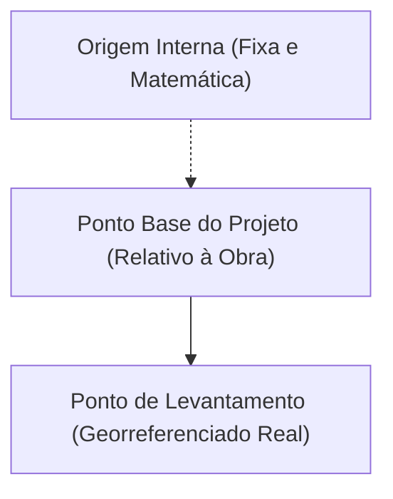

# Architectural Diátaxis Patterns & Templates

This reference provides canonical patterns and MDX templates for each of the four Diátaxis
quadrants used in the `docs/` workspace.

---

## 1. Quadrant 1: Tutorial Template (`tutorials/`)

Tutorials are learning-oriented lessons that guide beginner architects through building something
practical step-by-step.

```mdx
---
title: "Criando seu Primeiro Projeto Arquitetônico no Revit"
description: "Aprenda a iniciar um projeto, configurar níveis e modelar os primeiros eixos estruturais."
sidebar_position: 1
quadrant: "tutorial"
tags: ["revit", "primeiros-passos", "niveis", "eixos"]
---

# Criando seu Primeiro Projeto Arquitetônico no Revit

Este tutorial guia você pelo processo inicial de configuração de um projeto de arquitetura,
garantindo que sua base espacial esteja correta antes da modelagem dos elementos construtivos.

## O Que Você Irá Aprender

- Como selecionar o template arquitetônico padrão.
- Como criar e renomear níveis verticais de pavimentos.
- Como traçar eixos estruturais ortogonais e radiais.

## Pré-requisitos

- Autodesk Revit instalado e configurado.
- Compreensão básica de cotas de nível em projetos de arquitetura.

## Passo 1: Iniciando com o Modelo Arquitetônico

1. Abra a tela inicial do Revit e selecione **Novo Projeto**.
2. Na janela de diálogo, selecione o arquivo de modelo **Template Arquitetônico**.
3. Clique em **OK** para carregar a vista de planta do nível térreo.

:::tip[Dica de Organização]
Salve imediatamente o arquivo com uma nomenclatura padronizada, por exemplo,
`PROJ_ARQ_RESIDENCIAL_R00.rvt`.
:::

## Passo 2: Definindo Níveis Verticais

Os níveis representam os planos horizontais infinitos de referência para pisos e tetos.

1. No Navegador de Projeto, navegue até **Elevações** e abra a vista **Sul**.
2. Selecione a ferramenta **Nível** na aba **Arquitetura** (atalho: `LL`).
3. Posicione o cursor e clique para desenhar o Nível 2 com cota de `+3.00 m`.

## Próximos Passos

Agora que sua malha de níveis e eixos está pronta, continue para o tutorial de
[Modelagem de Paredes Básicas](./modelagem-paredes-basicas.mdx).
```

---

## 2. Quadrant 2: How-To Guide Template (`guides/`)

How-to guides are goal-oriented recipes that solve a specific problem in a series of direct steps.

```mdx
---
title: "Como Configurar Coordenadas Compartilhadas entre Revit e Topografia"
description: "Passo a passo para alinhar o modelo arquitetônico às coordenadas reais do levantamento topográfico."
sidebar_position: 2
quadrant: "guide"
tags: ["revit", "coordenadas", "topografia", "compatibilizacao"]
---

# Como Configurar Coordenadas Compartilhadas entre Revit e Topografia

Este guia orienta o alinhamento rigoroso do modelo arquitetônico com o arquivo DWG ou modelo IFC da
equipe de topografia, evitando desvios na compatibilização BIM.

## Cenário do Problema

Ao vincular a topografia, o terreno aparece em coordenadas UTM reais (milhões de metros de distância
da origem interna do Revit), gerando distorções gráficas ou desencaixes no modelo.

## Procedimento de Alinhamento

### 1. Vincular o Arquivo Topográfico

1. Acesse a aba **Inserir** e clique em **Vincular CAD** ou **Vincular IFC**.
2. No campo **Posicionamento**, selecione **Origem para Origem Interna**.
3. Posicione visualmente o lote em relação à orientação solar e limites do terreno.

### 2. Adquirir Coordenadas Reais

1. Na aba **Gerenciar**, localize o painel **Localização do Projeto**.
2. Clique no menu suspenso **Coordenadas** e selecione **Adquirir Coordenadas**.
3. Clique sobre o vínculo topográfico selecionado.

:::note[Confirmação de Sucesso]
O Ponto de Levantamento Topográfico (_Survey Point_) se deslocará automaticamente para a marca
georreferenciada da coordenada adquirida.
:::

## Verificação Final

Verifique se a cota de coordenadas do Ponto Base do Projeto indica os valores de Norte/Sul e
Leste/Oeste idênticos à memória de cálculo topográfica.
```

---

## 3. Quadrant 3: Technical Reference Template (`reference/`)

References are information-oriented descriptions of parameters, categories, tools, or shortcuts.

```mdx
---
title: "Catálogo de Parâmetros da Categoria Janelas no Revit"
description: "Matriz completa de parâmetros de tipo e de instância para famílias de janelas arquitetônicas."
sidebar_position: 3
quadrant: "reference"
tags: ["revit", "janelas", "parametros", "especificacao"]
---

# Catálogo de Parâmetros da Categoria Janelas no Revit

Esta referência detalha os parâmetros nativos da categoria de Janelas (_Windows_) no Autodesk Revit,
especificando suas funções nos quantitativos e detalhamentos executivos.

## Parâmetros de Instância

| Parâmetro            | Grupo               | Tipo de Dado | Função Prática                                                 |
| :------------------- | :------------------ | :----------- | :------------------------------------------------------------- |
| `Altura do Peitoril` | Restrições          | Comprimento  | Distância vertical da base da janela até o piso acabado.       |
| `Comentários`        | Dados de Identidade | Texto        | Observações de projeto ou revisões de fabricação.              |
| `Fase Criada`        | Fases               | Fase         | Etapa de cronograma em que o vão e o elemento são construídos. |

## Parâmetros de Tipo

| Parâmetro               | Grupo   | Tipo de Dado  | Função Prática                                   |
| :---------------------- | :------ | :------------ | :----------------------------------------------- |
| `Largura`               | Cotas   | Comprimento   | Dimensão horizontal do vão bruto de alvenaria.   |
| `Altura`                | Cotas   | Comprimento   | Dimensão vertical do vão bruto de alvenaria.     |
| `Transmitância Térmica` | Análise | Coeficiente U | Desempenho térmico do conjunto vidro e caixilho. |
```

---

## 4. Quadrant 4: Architectural Explanation Template (`explanation/`)

Explanations are understanding-oriented discussions on concepts, theory, and BIM methodology.

````mdx
---
title: "Entendendo os Três Pontos de Origem no Autodesk Revit"
description: "Compreensão conceitual sobre Origem Interna, Ponto Base do Projeto e Ponto de Levantamento Topográfico."
sidebar_position: 4
quadrant: "explanation"
tags: ["revit", "teoria-bim", "coordenadas", "georreferenciamento"]
---

# Entendendo os Três Pontos de Origem no Autodesk Revit

Para arquitetos acostumados com ambientes CAD bidimensionais, a gestão de coordenadas no Revit pode
parecer complexa. O software trabalha com três origens conceituais distintas no espaço tridimensional.

## 1. Origem Interna (_Internal Origin_)

A Origem Interna é o centro de gravidade matemático absoluto do arquivo RVT. Ela é fixa, imutável e
não pode ser movida pelo usuário. Todos os cálculos geométricos do motor gráfico referenciam esta
posição.

:::caution[Cuidado com Limites de Precisão]
Manter elementos do modelo a mais de 32 km da Origem Interna degrada a precisão de cálculo de ponto
flutuante, provocando falhas de exibição gráfica.
:::

## 2. Ponto Base do Projeto (_Project Base Point_)

O Ponto Base do Projeto serve como a origem de medição do canteiro de obras. Ele é tipicamente
posicionado no encontro de eixos estruturais importantes (como A-1) ou no canto de uma edificação.

## 3. Ponto de Levantamento Topográfico (_Survey Point_)

O Ponto de Levantamento Topográfico conecta o modelo ao sistema geodésico global (como SIRGAS 2000
ou UTM). Ele reflete as coordenadas reais do levantamento cartográfico fornecido pelo topógrafo.


````

```

```
