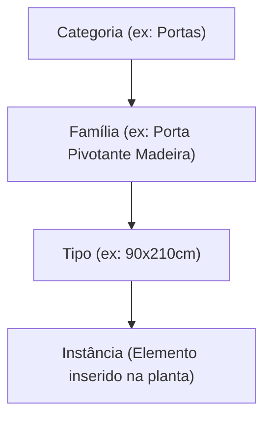
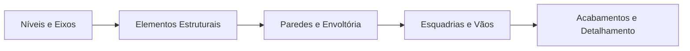

# MDX Architectural Documentation Syntax Reference

This reference outlines MDX syntax standards, frontmatter definitions, admonitions, and visual
diagram guidelines used in the `docs/` workspace.

---

## 1. Frontmatter Specification

Every `.mdx` architectural documentation file MUST begin with a complete YAML frontmatter block:

```yaml
---
title: "Título Didático do Documento"
description: "Descrição concisa em português do conteúdo e dos objetivos do documento."
sidebar_position: 1
quadrant: "tutorial"
tags: ["revit", "modelagem", "bim"]
---
```

### Supported Quadrant Values

- `tutorial`: Learning-oriented lesson for novices.
- `guide`: Problem-solving how-to guide.
- `reference`: Technical specifications, parameters, hotkeys, catalogs.
- `explanation`: Architectural theory, background, concepts, and BIM philosophy.

---

## 2. Admonitions (Alert Banners)

Use triple-colon admonitions (`:::`) with Brazilian Portuguese titles to emphasize key points:

```markdown
:::note[Nota de Projeto]
Contexto adicional sobre normas técnicas e recomendações da ABNT.
:::

:::tip[Dica de Eficiência]
Utilize o atalho de teclado `WA` para ativar a ferramenta de parede rapidamente no Revit.
:::

:::info[Especificação Técnica]
Este parâmetro afeta o cálculo volumétrico das tabelas de quantitativos da disciplina estrutural.
:::

:::caution[Atenção com Coordenadas]
Evite mover o Ponto Base do Projeto após o início da modelagem compartilhada.
:::

:::danger[Risco de Corrupção]
Nunca sincronize o modelo central enquanto outro colaborador estiver recarregando os vínculos.
:::
```

---

## 3. MDX Parsing & JSX Compliance Rules

MDX blends Markdown with JSX. Follow these rules to avoid compilation and parsing errors:

### A. Comments

Standard HTML comments (`<!-- comment -->`) are forbidden. Always use JavaScript comments wrapped in
curly braces:

```mdx
{/* Este é um comentário válido em MDX */}
```

### B. Special Character Escaping

Literal curly braces and less-than symbols trigger JSX parsing. Escape them in prose:

- Curly braces: `\{` e `\}`
- Less-than symbol: `\<`
- Greater-than symbol (when following tag-like syntax): `\>`

### C. Self-Closing HTML/JSX Tags

All elements without closing tags must be explicitly self-closed:

```mdx
<br />
<hr />
```

### D. Markdown inside JSX Blocks

When placing markdown inside JSX block elements, isolate markdown with blank lines:

```mdx
<div className="architectural-callout">

**Texto em negrito** com lista de itens:

- Elemento de fundação
- Viga de transição

</div>
```

---

## 4. Mermaid Diagrams in Architectural Documentation

Use Mermaid diagrams to visualize architectural workflows, BIM hierarchies, and project phases:

### A. Revit Object Hierarchy



### B. Modeling Workflow Diagram



**Rules for Mermaid**:

- Always define layout direction explicitly (`flowchart TD` or `flowchart LR`).
- Wrap node labels in quotes (`["Texto com (Parênteses)"]`).
- Avoid HTML tags inside Mermaid labels.

---

## 5. Architectural Parameter & Specification Tables

Use GitHub Flavored Markdown tables for parameter matrices, shortcuts, and LOD definitions:

| Parâmetro               | Tipo      | Agrupamento | Descrição Didática                                      |
| :---------------------- | :-------- | :---------- | :------------------------------------------------------ |
| `Espessura Total`       | Tipo      | Construção  | Define a largura real da camada composta da parede.     |
| `Restrição de Base`     | Instância | Restrições  | Nível associado à face inferior do elemento modelado.   |
| `Deslocamento Superior` | Instância | Restrições  | Distância vertical relativa ao nível superior de corte. |

---

## 6. Prettier Formatting Standards

All MDX documents must strictly adhere to project formatting:

- Indentation: exactly 2 spaces.
- Maximum line width: 100 characters for prose.
- Unordered lists: hyphens (`-`) only.
