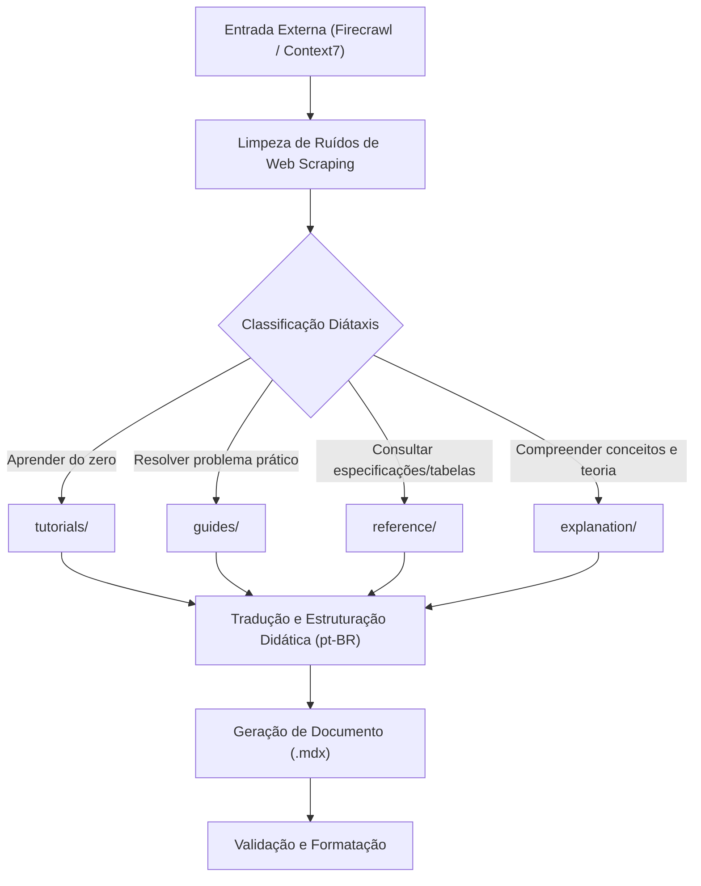

# Architectural Knowledge Extraction & Validation Workflow

This reference defines the end-to-end pipeline for ingesting external data (via Firecrawl and
Context7), categorizing content into Diátaxis quadrants, authoring in Portuguese (pt-BR), and
performing validation.

---

## 1. Extraction & Ingestion Pipeline

When receiving architectural data scraped by external tools (e.g., Firecrawl, Context7, or vendor
portals):

### Step 1: Strip Scrape Noise

Scraped HTML or Markdown often contains navigational headers, footer links, cookie alerts, and
floating UI elements. Strip the following artifacts before parsing content:

- Navigation breadcrumbs and header links (`[Voltar ao início]`, `[Pular para o conteúdo]`).
- Floating menus (`Copiar como Markdown`, `Abrir no leitor`).
- AI assistant chat boxes (`Perguntar ao assistente`, `Ajuda com IA`).
- Feedback buttons (`Esta página foi útil?`, `Enviar comentário`).
- Broken local image references pointing to temporary scratch paths.

### Step 2: Diátaxis Quadrant Classification

Analyze the primary intent of the content to choose the correct directory:

| Se o conteúdo foca em...                                | Quadrante Diátaxis      | Diretório de Destino    |
| :------------------------------------------------------ | :---------------------- | :---------------------- |
| Ensinar um novato através de uma lição guiada           | Tutorial                | `<domain>/tutorials/`   |
| Resolver um problema arquitetônico específico           | Guia Prático (_How-to_) | `<domain>/guides/`      |
| Listar especificações, parâmetros, atalhos, tabelas     | Referência Técnica      | `<domain>/reference/`   |
| Discutir conceitos teóricos, metodologia BIM, histórico | Explicação Teórica      | `<domain>/explanation/` |

### Step 3: Didactic Translation to Portuguese (pt-BR)

- Translate and rewrite all content in Brazilian Portuguese.
- Ensure the tone is pedagogical and welcoming for an architect studying the subject.
- Keep standard software terminology accessible, citing English terms in parentheses where helpful
  (e.g., "Parâmetros Compartilhados (_Shared Parameters_)").

### Step 4: MDX Formatting

- Assign appropriate YAML frontmatter (`title`, `description`, `sidebar_position`, `quadrant`,
  `tags`).
- Use MDX admonitions (`:::tip`, `:::note`, `:::caution`).
- Format parameter sets into structured Markdown tables.

---

## 2. Validation & Quality Checklist

Before finalizing any document creation or edit in `docs/`, verify the following items:

1. **File Extension**: Every technical document MUST use the `.mdx` extension.
2. **Language**: The entire document must be written in Portuguese (pt-BR).
3. **No Emojis**: Verify zero emojis are present across text, titles, and diagrams.
4. **No Placeholders**: Confirm no "TODO", "TBD", or empty sections exist.
5. **Relative Links**: Ensure all links use relative paths pointing to existing files.
6. **Prettier Compliance**: Check that indentation is 2 spaces and line width is under 100
   characters.
